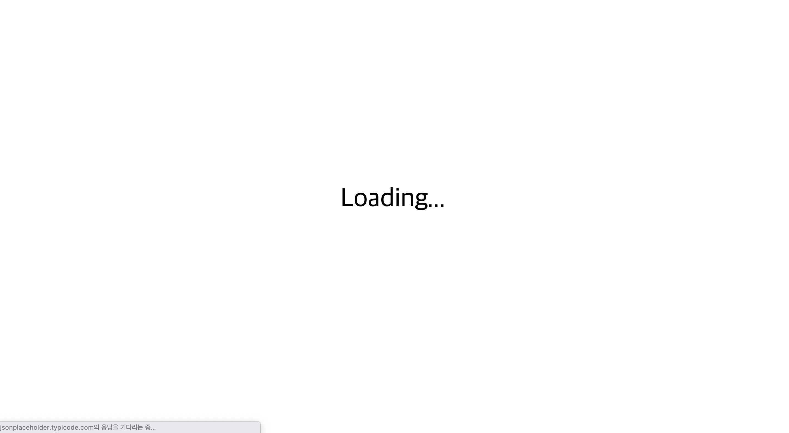
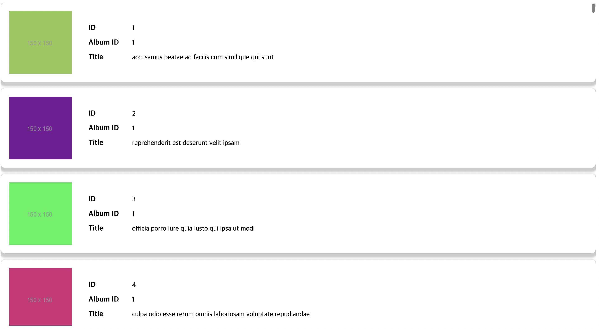
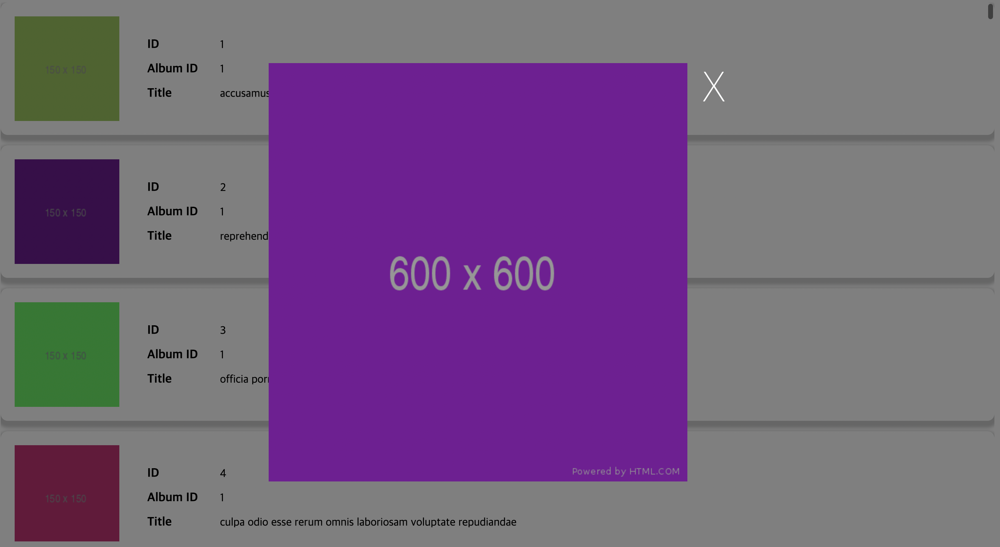

# 앨범 조회 서비스

## 실행

    ```
    npm install
    npm start
    ```

## 화면

1. 로딩화면
   
2. 앨범 목록조회
   
3. 앨범 상세이미지 조회
   

## AXIOS를 활용한 API 접근

-  src/utils/api.js

## 사용 API

-  https://jsonplaceholder.typicode.com/photos
