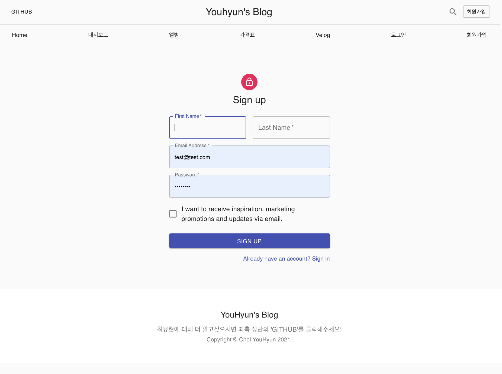

# Material-UI 과제

-  `material-ui` 를 활용한 블로그 제작 프로젝트입니다.

## 실행

```
npm install
npm start
```

## 설치

```
    "@material-ui/core": "^4.12.3",
    "@material-ui/icons": "^4.11.2",
    "clsx": "^1.1.1",
    "react-hook-form": "^7.15.0",
    "react-router-dom": "^5.3.0",
    "recharts": "^2.1.2",
```

## 화면

-  HOME
   
-  DASHBOARD
   
-  ALBUM
   
-  PRICING
   
-  SIGN IN
   
-  SIGN UP
   
